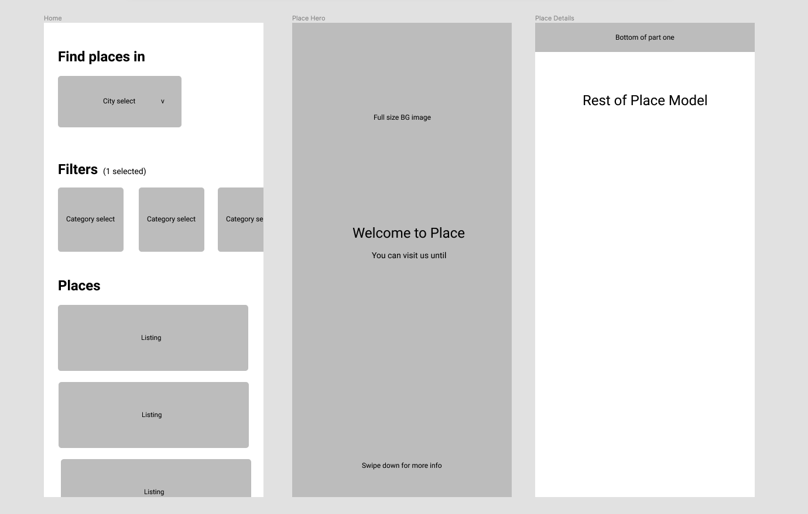

# The Curation

Web application to help distinguished users find good food.

## Design and Specification

)

#### Pages

* Home screen
* Place screen
* Submit screen (admin)
* Review screen (admin)

#### Models

* City
* Place
  * Place Image
* Submission
* User
* Guestbook (post mvp?)


## Set up and installation

**Please ensure ports 8000 and 3000 are free before running any commands.**

### Server

Install and run the server:

```bash
make install
```

Make the database (**while the server is running**):

```bash
make database
```

Check the [server readme](server/README.md) for more information.

### Client

Install and run the client:

```bash
cd client
npm install
npm start
```

Check the [client readme](client/README.md) for more information.

